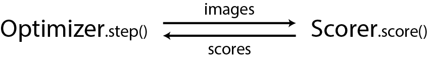
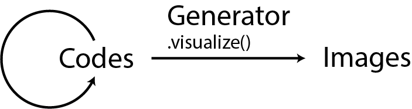

Preprint available at https://www.biorxiv.org/content/10.1101/516484v1

Update (19/4/3): Added rudimentary support for PyTorch.
    See below for details.

## Introduction
XDream (E**x**tending **D**eepDream with **r**eal-time **e**volution
for **a**ctivity **m**aximization in real neurons)
is a package for visualizing the preferred input of
units in non-differentiable visual systems—such as
the visual cortex—through activation maximization.

Well-known network visualization techniques such as DeepDream
depend on the objective function being differentiable down to
the input pixels. In cases such as the visual cortext in the brain,
these gradients are unavailable.

However, visualization without gradients can be framed as a
black-box optimization problem. Such a problem can be approached
by an iterative process where
1. Images are shown;
2. Each image receives a scalar "score";
3. Scores are used to optimize the images.   

Two optimizers are implemented here: a simple genetic algorithm
and a gradient estimation algorithm based on finite differences.

A further component—generative neural networks—is introduced to make
the search space diverse yet still tractable. Instead of 
optimizing images, the optimization algorithm manipulates
"codes" used to generate images. Since codes are the learned input
to a generative network, searching in code space avoids searching
uninteresting noise images, for example salt-and-pepper noise.

As an example, we use the DeepSiM generators from
[Dosovitskiy & Brox, 2016](https://arxiv.org/abs/1602.02644).
The interface to DeepSiM generators depends on
[`caffe`](http://caffe.berkeleyvision.org), but is modular and
can be replaced by other generative neural networks and indeed any other
image parameterization (e.g.,
[Yamane et al., 2008](https://www.nature.com/articles/nn.2202),
[Mordvintsev et al., 2018](https://distill.pub/2018/differentiable-parameterizations/)
).

## Prerequisites
- The [caffe](http://caffe.berkeleyvision.org) or
    the [PyTorch](http://pytorch.org) library.
    
    On ubuntu \> 17.04, caffe can be easily
    [installed](http://caffe.berkeleyvision.org/install_apt.html)
    with
    > sudo apt install caffe-cpu
    
    for CPU-only version, or
    > sudo apt install caffe-cuda
    
    for CUDA version.
    
    For PyTorch, please visit the official website for
    installation instructions.

- `local_settings.py`. Copy it from `local_settings.example.py` and 
    modify the contents to match your system.

- Pretrained generative networks.
    The DeepSiM generators can be downloaded from
    [here](https://lmb.informatik.uni-freiburg.de/people/dosovits/code.html)
    (caffe version). The prototxt files (slightly modified from original) are included
    in the prototxt folder.
    
    The caffe models have been converted into PyTorch.
    They are defined in `tf_nets.py`, and the weights are available
    [here](https://drive.google.com/open?id=1sV54kv5VXvtx4om1c9kBPbdlNuurkGFi).
   
  Please make sure the paths defined in `net_catalogue.py` match
   the downloaded `.caffemodel`, `.prototxt`, and/or `.pt` files. 
   

- (For the demo) The reference caffenet model. It can be found
    [here](https://github.com/BVLC/caffe/tree/master/models/bvlc_reference_caffenet).
    Please save the model files to the paths defined in
    `net_catalogue.py`. Other vision models can also be used.

## Demo
Run
> python experiment_CNN.py

The demo currently requires caffe.

## To extend
Experiment modules
(`EphysExperiment` & `CNNExperiment` in `Experiments.py`)
and scripts (`experiment.py` & `experiment_CNN.py`) are included
to exemplify how to define/control an experiment using this package.

To extend this package for use with your experimental system,
at the least you may need to extend the `_get_scores()` method of
`WithIOScorer`. For example, in `EPhysScorer`, we write online
recording data in a .mat file and the `_get_scores()` method
reads it from disk.

Some additional tools are included for creating
the initial generation of codes (for genetic algorithm) and
empirically optimizing hyperparameters.

